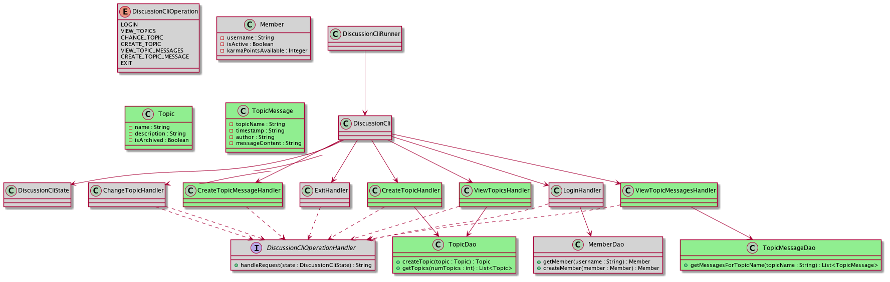

ATA Discussion CLI - GILA

# GILA Roles

Read more about the roles: https://w.amazon.com/bin/view/Amazon_Technical_Academy/Internal/HowTos/GILARoles

# Activity

*This activity will provide you practice annotating POJOs for use with
 DynamoDBMapper, and loading and saving items via DynamoDBMapper.*

Before you start, complete the form below to assign a role to each member.

If you have 3 people, combine the *Presenter* and *Reflector*.

|Team Roles    | Team Member                                                                |
|---           |---                                                                         |
|*Recorder*    |records all answers and questions, provides copies to team and facilitator. |
|*Presenter*   |talks to facilitator and other teams.                                       |
|*Manager*     |keeps track of time and makes sure everyone contributes appropriately.      |
|*Reflector*   |considers how the team could work and learn more effectively.               |

## Phase 1: Try out the CLI

|Phase 1                        |Start time:  |
|---                            |---          |
|(20 minutes) Try out the CLI   |             |

Start `ada` running in a terminal with the same options you used in the prework. Those were:

**AWS account:** (account number for your <Alias>ATAUnit3 account -- 
[find on Conduit](https://access.amazon.com/aws/accounts))

**role:** IibsAdminAccess-DO-NOT-DELETE


*[Discussion CLI class diagram UML source](https://tiny.amazon.com/1b0h57e33/plancorpamazplanformencohtml)*

We have provided a class diagram of the Discussion CLI service.
The classes you will be touching today are highlighted in green.

The ATA Discussion CLI works in a similar way to your project, where we have multiple operations that can be chosen
from. While in your project there are multiple `Activity` classes and a `LambdaRouter` that sends requests to different
endpoints to the correct activity, in the ATA Discussion CLI a `DiscussionCli` class lets a user select on the command
line which action to perform, then runs the appropriate `Handler` class.

Execute `rde workflow run dynamodbannotationsloadsave-classroom-cli`. This will start a command line interface and
prompt you for text input in the terminal where you ran the workflow.

Our Discussion CLI is a little creaky in places, but it's starting to take shape. See if you can:
1. Log in and provide a username. If you haven't logged in before, what happens?
   1. 
2. At the moment, we are unable to load into the CLI. Attempting to retrieve topics fails.
   What is the type of exception thrown by the CLI?
   1. 
3. What is the error message thrown by the exception?
   1. 
4. What class in our service (a POJO in the `dynamodbannotationsloadsave.dynamodb` package) is referenced
   in the exception message?
   1. 
5. Which of the tables you deployed as preparation for this lesson contain items of this class?
   1. 
6. What annotation does the exception message say is missing on the class?
   1. 

### Coding

Before you continue, ensure you are on a feature branch `dynamodbannotationsloadsave-classroom` with the
latest version of the Snippets code.

Apply any missing DynamoDB annotations to the class in `dynamodbannotationsloadsave.dynamodb`
(your answer to question 5 above). You'll know you've done it when you can run the cli and get to a screen
that looks like:

```none
What would you like to do?
1: View topics
2: Select topic
3: View messages in topic
4: Create new topic
5: Post message to topic
6: Exit
``` 

**GOAL:** Reach the command options page of the Discussion CLI

Phase 1 is complete when:
* You have added the missing DynamoDB annotations
* You see a list of command options in the CLI

When you have successfully made your changes and reached the command
options page of the CLI, please mark the checkbox next to your role below: 
 
* Manager
* Presenter
* Reflector
* Recorder

## Phase 2: Creating topics

|Phase 2                        |Start time:  |
|---                            |---          |
|(15 minutes) Creating topics   |             |

Now that you can retrieve topics and view the other command options, try option 4,
"Create new topic".

1. What happens after you submit a new topic?
   1. 
2. Does that new topic appear when you choose to "View topics"?
   1. 
3. Which `Handler` class is responsible for creating topics?
   1. 
4. What happens when you run `rde wflow run dynamodbannotationsloadsave-clasroom-tests`
   1. 
5. Which of the failing tests seem relevant to creating topics?
   1. 
6. Based on the failing tests, which class/es will you need to update?
   1. 
   
### Coding

Based on your answers to questions 3 and 4, update any necessary class/es to
get "Create new topic" working correctly.

**GOAL:** You can create a new topic with "Create new topic" and then see it when
choosing the "View topics" option

Phase 2 is complete when:
* You can create a new topic with "Create new topic"
* You can see that new topic when choosing the "View topics" command option

When you have successfully made your changes and can create and view new topics,
please mark the checkbox next to your role below: 
 
* Manager
* Presenter
* Reflector
* Recorder

## Phase 3: Creating topic messages

|Phase 3                                |Start time:  |
|---                                    |---          |
|(20 minutes) Creating topic messages   |             |

Okay, now we're getting somewhere. Next, try to "Post message to topic". This is the
`CREATE_TOPIC_MESSAGE` operation.

1. What happens when you choose "Post message to topic"?
   1. 
2. Which `Handler` class is responsible for posting new messages?
   1. 
3. What happens when you run `rde wflow run dynamodbannotationsloadsave-clasroom-tests`
   1. 
4. Which failing tests seem relevant to posting messages?
   1. 
5. Based on the failing tests, which class/es will you need to update?
   1. 
   
If you want more information than the failing unit tests, you can also use the debugger
to step through the code by starting from the `main()` method in `DiscussionCliRunner`.

### Coding

Based on your answers to questions 2 and 3, update any necessary class/es to
get "Post message to topic" working correctly.

**GOAL:** You can create new topic messages with "Post message to topic" and then see
them when selecting "View messages in topic"

Phase 3 is complete when:
* You can create new topic messages with "Post message to topic"
* You can see those messages when selecting "View messages in topic"
* Workflow `dynamodbannotationsloadsave-classroom-tests` succeeds (all tests passing)

When you have successfully made your changes and can create and view new topic messages,
please mark the checkbox next to your role below: 
 
* Manager
* Presenter
* Reflector
* Recorder

## Phase 4: Try hitting production

|Phase 4                               |Start time:  |
|---                                   |---          |
|(10 minutes) Try hitting production   |             |

Now that your CLI is working properly, let's make it a little more interesting and all use the same tables!

Go to your terminal running the `ada` command and hit Ctrl-C to stop it.

Change your AWS account and role to the shared one we used in Intro to DynamoDB:

**AWS account:** 161358278188

**Role:** ATACurriculum-SharedParticipantDynamoDB

Restart `ada` with these settings and try running your CLI against the shared tables!

1. As a group, choose a new topic for discussion. Have one member create that new topic.
   What was your topic?
   1. 
1. Once the new topic is created, ensure everyone in the group posts at least one message to that topic.
1. Read each other's posted messages using your own CLI!
1. You can also post to topics that are already there and respond to the rest of your classmates!

When you have successfully posted a message to the shared class topics, please mark the
checkbox next to your role below:
 
* Manager
* Presenter
* Reflector
* Recorder

Once you've had an opportunity to mess around sending messages in the shared account, feel free to move
on to the extensions.

## Extensions

The following extensions give you the opportunity to practice some of the same service
development skills you've already demonstrated in today's activity, as well as a chance
to try your hand at some later topics, like setting up a new DynamoDB table.

For these extensions, please switch `ada` back to your Unit 3 AWS account to avoid
impacting other participants as you update the CLI and create new tables. You can
choose to do any of these extensions, no need to attempt them in the order listed.

### Extension 1: Add ability to give karma points to messages
1. Create a new table for MessageKarmaGifts (select "Create table" in the DynamoDB console,
   or try using the CloudFormation templates from the two DynamoDB lessons as a guide and
   deploy it like you have those templates):

    * **messageKey:** String `"<topicName>|<timestamp>"` - concatenation of the topic
      name and the timestamp for the message of interest,
      e.g. `"My Topic|2020-01-14T13:36:01.000Z"`
    * **memberId:** String - the username of the member who gifted the karma
    * **karmaPointsGiven:** Number - the number of karma points given to the message

1. Create your model and annotate it
1. Create your DAO
1. Create the `GiveKarmaHandler` to handle this operation, and wire accordingly
    1. Ask for the message number (corresponds to indexes in `state.getListedMessages()`)
    1. Ask how many Karma points to give
    1. Do some validation (make sure it's a positive number)
    1. Create the Karma gift
    1. Set the next operation to be DiscussionCliOperation.VIEW_TOPIC_MESSAGES
1. More validation: make sure member doesn't give more karma points than they have
1. Accounting: Deduct karma points from the gifter. Makes it a more meaningful gesture!
1. Add points to the member who authored the message receiving the karma points.
1. Public recognition: update the display of topic messages to show karma points given
   for each message.
   
### Extension 2:

1. Show an error message to a user if they try to create a topic with a name that already
   exists, and set the next operation to be `DiscussionCliOperation.CREATE_TOPIC`.
   
### Extension 3:

1. When a user creates a new topic, add a system-generated welcome message as the first
   message in the topic

### Extension 4: Oops, let me edit that

1. Allow editing an existing message (but only a member's own message). Keep a Boolean,
   `isEdited` so it can be displayed next to the message.
1. Also track the `lastEditedTime` for each message (if it has been edited).

